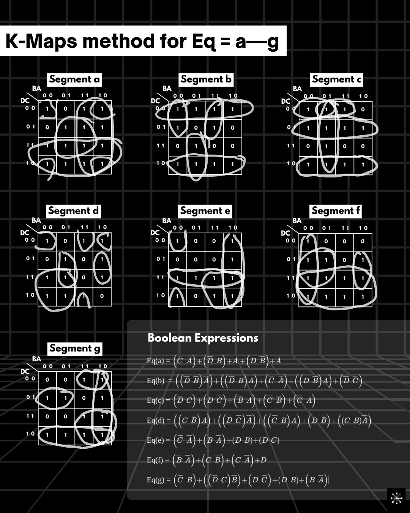
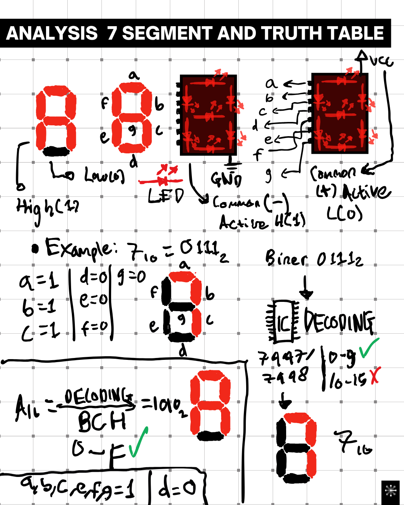

# K-Maps Method

# Truth Table
| D | C | B | A | a | b | c | d | e | f | g | Q |
|---|---|---|---|---|---|---|---|---|---|---|---|
| 0 | 0 | 0 | 0 | 1 | 1 | 1 | 1 | 1 | 1 | 0 | 0 |
| 0 | 0 | 0 | 1 | 0 | 1 | 1 | 0 | 0 | 0 | 0 | 1 |
| 0 | 0 | 1 | 0 | 1 | 1 | 0 | 1 | 1 | 0 | 1 | 2 |
| 0 | 0 | 1 | 1 | 1 | 1 | 1 | 1 | 0 | 0 | 1 | 3 |
| 0 | 1 | 0 | 0 | 0 | 1 | 1 | 0 | 0 | 1 | 1 | 4 |
| 0 | 1 | 0 | 1 | 1 | 0 | 1 | 1 | 0 | 1 | 1 | 5 |
| 0 | 1 | 1 | 0 | 1 | 0 | 1 | 1 | 1 | 1 | 1 | 6 |
| 0 | 1 | 1 | 1 | 1 | 1 | 1 | 0 | 0 | 0 | 0 | 7 |
| 1 | 0 | 0 | 0 | 1 | 1 | 1 | 1 | 1 | 1 | 1 | 8 |
| 1 | 0 | 0 | 1 | 1 | 1 | 1 | 1 | 0 | 1 | 1 | 9 |
| 1 | 0 | 1 | 0 | 1 | 1 | 1 | 0 | 1 | 1 | 1 | A |
| 1 | 0 | 1 | 1 | 1 | 1 | 1 | 1 | 1 | 1 | 1 | B |
| 1 | 1 | 0 | 0 | 1 | 0 | 0 | 1 | 1 | 1 | 0 | C |
| 1 | 1 | 0 | 1 | 1 | 1 | 1 | 1 | 1 | 1 | 0 | D |
| 1 | 1 | 1 | 0 | 1 | 0 | 0 | 1 | 1 | 1 | 1 | E |
| 1 | 1 | 1 | 1 | 1 | 0 | 0 | 0 | 1 | 1 | 1 | F |

# Analysis 7 Segment & Truth Table

# Boolean Expressions
* $Eq(a) = (\bar{C}\bar{A}) + (\bar{D}B) + A + (D\bar{B}) + \bar{A}$
* $Eq(b) = ((\bar{D}\bar{B})\bar{A}) + ((\bar{D}B)A) + (\bar{C}\bar{A}) + ((D\bar{B})A) + (D\bar{C})$
* $Eq(c) = (\bar{D}C) + (D\bar{C}) + (\bar{B}A) + (\bar{C}\bar{B}) + (\bar{C}A)$
* $Eq(d) = ((C\bar{B})A) + ((\bar{D}\bar{C})\bar{A}) + ((\bar{C}B)A) + (D\bar{B}) + ((CB)\bar{A})$
* $Eq(e) = (\bar{C}\bar{A}) + (B\bar{A}) + (DB) + (DC)$
* $Eq(f) = (\bar{B}\bar{A}) + (C\bar{B}) + (C\bar{A}) + D$
* $Eq(g) = (\bar{C}B) + ((\bar{D}C)\bar{B}) + (D\bar{C}) + (DB) + (B\bar{A})$
